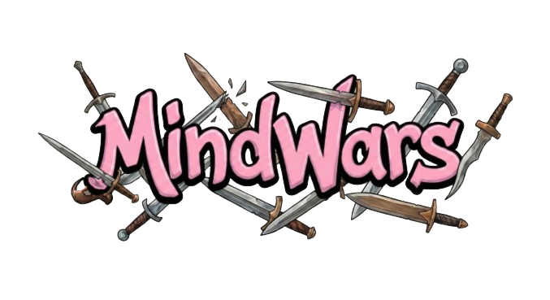

# MindWars



 "Where brains conquer" 


### Description
A 2-player hot seat trivia game where players answer questions to earn points and conquer territory on a shared map.


## Build & Run

```bash
javac -d out -cp "lib/*" src/**/*.java
java -cp "out:lib/*" Main
```

Requires Java 17+ and GSON (included in `lib/`).

## Project Structure

```text
src/
├─ Main.java                         # Entry point (Swing GUI, --console for legacy)
├─ CheckQuestions.java               # Utility to validate questions.json
│
├─ model/                            # MVC — Model
│  ├─ GameModel.java                 # Observable game state
│  ├─ GamePhase.java, AnswerResult.java, GameSettings.java
│  ├─ LeaderboardStore.java          # JSON leaderboard persistence
│  └─ LeaderboardEntry.java, User.java
│
├─ view/                             # MVC — Views (Swing screens + widgets)
│  ├─ MainFrame.java                 # Main game window (CardLayout host)
│  ├─ MainWindow.java                # Login/register window (shown before MainFrame)
│  ├─ MainMenuView, GameSetupView, GameBoardView
│  ├─ TerritoryClaimView, HotSeatView, InvasionSelectView
│  ├─ GameOverView, BettingView, LeaderboardView
│  ├─ RulesView, SettingsView, LoadGameView
│  ├─ NetworkSetupView, NetworkLobbyView, NetworkGameView
│  ├─ MenuPanel, RegisterPanel, SettingsPanel, SettingOptionCard
│  ├─ GradientButton                 # Shared Swing widget
│  └─ PlaceholderView, MindWarsTheme, AnimationHelper
│
├─ controller/                       # MVC — Controllers
│  ├─ GameController.java            # Main game controller + undo history
│  ├─ NavigationController.java      # Screen navigation interface
│  └─ LoginController.java, RegisterController.java
│
├─ command/                          # Command pattern (undo)
│  ├─ Command.java, CommandHistory.java
│  └─ AnswerCommand.java, ClaimCellCommand.java, InvasionCommand.java
│
├─ bot/                              # Strategy pattern (automatic player)
│  ├─ BotStrategy.java
│  └─ EasyBot.java, MediumBot.java, HardBot.java
│
├─ network/                          # Server-Client multiplayer
│  ├─ GameServer.java, GameClient.java
│  ├─ NetworkSession.java
│  ├─ NetworkMessage.java, MessageCodec.java
│  └─ GameServerTest.java
│
├─ game/                             # Core game logic (shared + console)
│  ├─ Game.java                      # Console orchestrator (--console)
│  ├─ GameState.java                 # Mutable state (players, current turn)
│  ├─ TurnManager.java               # Turn order logic
│  ├─ WinnerCalculator.java          # Final winner (score + territory tiebreaker)
│  ├─ NumericWinnerCalculator.java   # Estimation round winner (closest + fastest)
│  ├─ MapGrid.java                   # Territory grid with fog of war and bonus cells
│  ├─ Bonus.java, Weapon.java, WeaponType.java
│  └─ SaveGameManager.java, SavedGameData.java  # Memento skeleton
│
├─ player/                           # Player data model
│  └─ Player.java                    # Name, score, timer, streak, symbol
│
├─ trivia/                           # Question management
│  ├─ QuestionType.java              # Enum (MCQ, True/False, Numeric, Open-Ended, Ordering)
│  ├─ Question.java                  # Question model with multi-type support
│  ├─ QuestionBank.java              # Loads questions from JSON by category & difficulty
│  └─ AnswerValidator.java           # Input validation and answer checking
│
├─ persistence/                      # SQLite persistence (users / auth)
│  ├─ DatabaseInitializer.java, DatabaseManager.java
│  └─ UserRepository.java, PasswordUtil.java
│
└─ util/                             # Non-view helpers (console + audio)
   ├─ ConsoleIO.java                 # Console I/O with timeout and countdown
   ├─ SoundManager.java              # Async WAV playback (one-shot + looping)
   └─ AudioSettings.java             # Sound/music toggles
```
