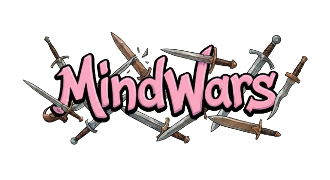

# MindWars



> *"Where brains conquer"*

A trivia game for 1–4 players where players answer questions to earn points and conquer territory on a shared map. Modes: solo (1 player vs bot), hot-seat (2–4 humans on one machine), or LAN multiplayer (up to 4 humans across machines).

---

## Requirements

- Java 17+
- macOS, Linux, or Windows

All other dependencies (Gson, SQLite JDBC) are bundled in [lib/](lib/).

## Configure

No setup required — the game runs out of the box. Files in the project root:

- `questions.json` — trivia bank (replace to use your own)
- `leaderboard.json`, `mindwars.db` — auto-created on first run

In-game audio and difficulty are configurable from the **Settings** screen.

## Compile

From the project root:

```bash
# macOS / Linux
mkdir -p out
find src -name "*.java" -print0 | xargs -0 javac -d out -cp "lib/*"
```

```powershell
# Windows (PowerShell)
mkdir out
javac -d out -cp "lib/*" (Get-ChildItem -Recurse src -Filter *.java).FullName
```

## Run

```bash
# macOS / Linux
java -cp "out:lib/*" Main

# Windows
java -cp "out;lib/*" Main
```

Add `--console` to launch the legacy console mode instead of the GUI.

For **LAN multiplayer**, one player picks *Multiplayer → Host*; the other picks *Join* and enters the host's IP and port (default `5555`). Both press **Ready** to start.

## Deploy

To ship to another machine, copy these into a single folder:

```
out/  lib/  assets/  questions.json
```

The target machine just needs Java 17+ and runs the same command above from inside that folder.

Or build a runnable JAR:

```bash
jar cfe MindWars.jar Main -C out .
java -cp "MindWars.jar:lib/*" Main
```

## Known Limitations

- LAN-only multiplayer (no NAT traversal / internet play)
- Maximum 4 players per match
- Bot opponent is only available in 1-player solo mode; 2–4 player matches are humans only
- Single save slot (saving overwrites the previous one)
- Single-level undo, only during territory claim
- `questions.json` is loaded once at startup — restart to pick up edits
- Local leaderboard only (no online sync)
- UI is tuned for ~1280×800; smaller windows may clip

## Documentation

- **User manual / wiki:** https://github.com/SwEng-UCM/MindWars-IS2/wiki
- [AgileInception.pdf](AgileInception.pdf) — agile inception document
- [AI-DECLARATION.md](AI-DECLARATION.md) — AI usage declaration
- [GitGuidelines.md](GitGuidelines.md) — git workflow
- [UML/](UML/) — UML diagrams

---

## Project Structure

```text
src/
├─ Main.java                         # Entry point (Swing GUI, --console for legacy)
├─ CheckQuestions.java               # Utility to validate questions.json
│
├─ model/                            # MVC — Model
│  ├─ GameModel.java                 # Observable game state
│  ├─ GamePhase.java, AnswerResult.java, GameSettings.java
│  ├─ GameMemento.java, GameMementoStore.java   # Save/load (Memento pattern)
│  ├─ LeaderboardStore.java          # JSON leaderboard persistence
│  └─ LeaderboardEntry.java, User.java
│
├─ view/                             # MVC — Views (Swing screens + widgets)
│  ├─ MainFrame.java                 # Main game window (CardLayout host)
│  ├─ MainWindow.java                # Login/register window
│  ├─ MainMenuView, GameSetupView, GameBoardView
│  ├─ TerritoryClaimView, HotSeatView, InvasionSelectView
│  ├─ GameOverView, BettingView, LeaderboardView
│  ├─ RulesView, SettingsView, LoadGameView
│  ├─ NetworkSetupView, NetworkLobbyView, NetworkGameView
│  ├─ MenuPanel, RegisterPanel, SettingsPanel, SettingOptionCard
│  ├─ GradientButton                 # Shared Swing widget
│  └─ PlaceholderView, MindWarsTheme, AnimationHelper
│
├─ controller/                       # MVC — Controllers
│  ├─ GameController.java            # Main game controller + undo history
│  ├─ NavigationController.java      # Screen navigation interface
│  └─ LoginController.java, RegisterController.java
│
├─ command/                          # Command pattern (undo)
│  ├─ Command.java, CommandHistory.java
│  └─ ClaimCellCommand.java
│
├─ bot/                              # Strategy pattern (automatic player)
│  ├─ BotStrategy.java
│  └─ EasyBot.java, MediumBot.java, HardBot.java
│
├─ network/                          # Server-Client multiplayer
│  ├─ GameServer.java, GameClient.java
│  ├─ NetworkSession.java, NetworkAddress.java
│  ├─ NetworkMessage.java, MessageCodec.java
│  └─ GameServerTest.java
│
├─ game/                             # Core game logic (shared + console)
│  ├─ Game.java                      # Console orchestrator (--console)
│  ├─ GameState.java                 # Mutable state (players, current turn)
│  ├─ TurnManager.java               # Turn order logic
│  ├─ WinnerCalculator.java          # Final winner (score + territory tiebreaker)
│  ├─ NumericWinnerCalculator.java   # Estimation round winner (closest + fastest)
│  ├─ MapGrid.java                   # Territory grid with fog of war and bonus cells
│  └─ Bonus.java, Weapon.java, WeaponType.java
│
├─ player/                           # Player data model
│  └─ Player.java                    # Name, score, timer, streak, symbol
│
├─ trivia/                           # Question management
│  ├─ QuestionType.java              # Enum (MCQ, True/False, Numeric, Open-Ended, Ordering)
│  ├─ Question.java                  # Question model with multi-type support
│  ├─ QuestionBank.java              # Loads questions from JSON by category & difficulty
│  └─ AnswerValidator.java           # Input validation and answer checking
│
├─ persistence/                      # SQLite persistence (users / auth)
│  ├─ DatabaseInitializer.java, DatabaseManager.java
│  └─ UserRepository.java, PasswordUtil.java
│
└─ util/                             # Non-view helpers (console + audio)
   ├─ ConsoleIO.java                 # Console I/O with timeout and countdown
   ├─ SoundManager.java              # Async WAV playback (one-shot + looping)
   └─ AudioSettings.java             # Sound/music toggles
```

## License

See [LICENSE](LICENSE).
